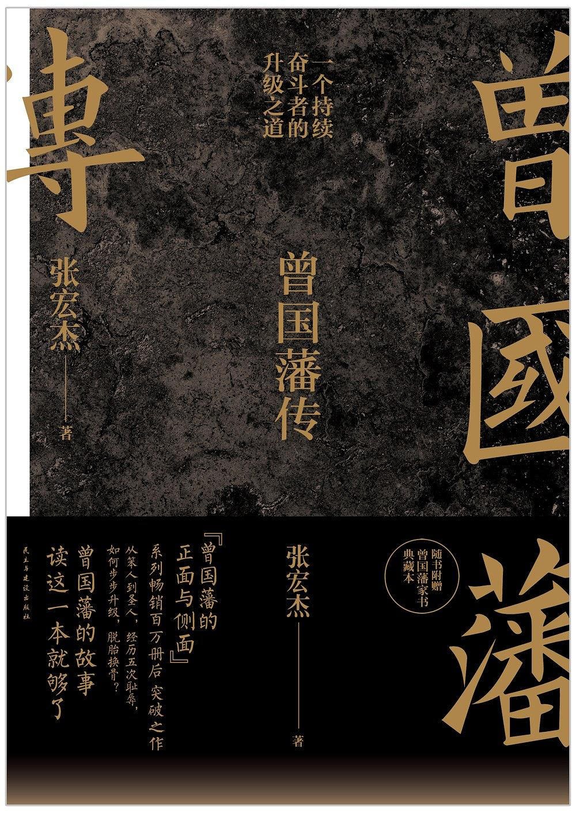

# 知识地图
建这个Git库的初心是整理自己的知识体系。过往不恋，从今日（2020年2月14日）起，纳入这个知识地图的标准只有一个：我为这个知识点（书、主题、实践等）写一篇摘要提交到库里，每个知识点都有对应的摘要链接。 

希望有一天我能将这些点结成网去捕鱼。

## 2020 鼠年
2020年是个艰难的年份，今天是情人节，受新冠状病毒疫情的影响，跟整个春节假期一样宅在家。大环境艰难，行业大变，公司不佳，个人更是元旦至今已重启了两次，眼见今年将是我有生以来挑战最大的一年。

36岁是本命年，以“七年就是一辈子”而论，是第6辈子的开始。“从前种种，譬如昨日死；从后种种，譬如今日生。” 新生，意味着洗涤过去而重生。屡败不妨屡战，要知道曾国藩33为京官，43岁的时候开始练兵，44岁第一次投水自杀。47岁在家蛰伏两年才有“脱胎换骨”之变。

