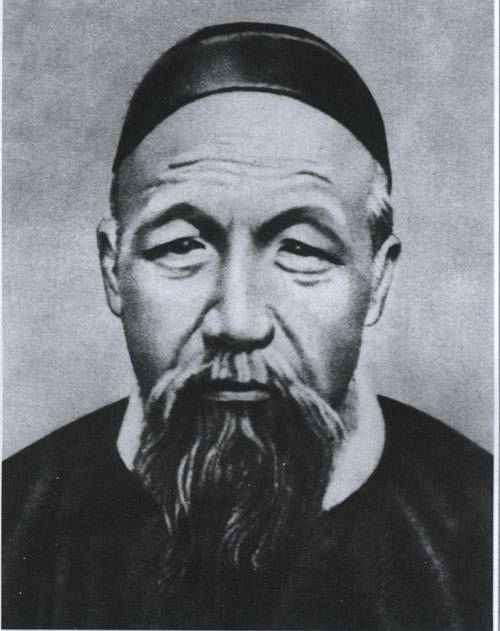

## 摘要
在猪年大年三十晚上看完了张宏杰的这本《曾国藩传》，曾国藩来就是大IP，罗胖跨年演讲那句“躬身入局者，皆为我辈。” 让我重新拾起这本上半年未看完的书。

曾国藩最吸引人的地方大概是他以五六百年祖上没有出过秀才的出身，以及普通的天资和羸弱的身体，取得如此之高的成就。但要是觉得自己跟他一样的起点，努力一下也能有所成就，大概就错了。他的日记里充满对自己的批判，经常提起”焦灼“、”肝胆俱裂“，到生命的最后还和赵烈文说：“吾日夜望死，忧见宗祐之陨”。他无疑是个痛苦的人，这不是念叨着“吃得苦中苦方为人上人”这样的鸡汤咒语就能度过的，他有深厚的儒家理学信仰作为支撑。他当然不快乐，但求仁得仁，无疑是幸福的。

### 印象最深的有几个地方
1. 三十岁开始学圣人，开始持之以恒写日记，给自己定了12条做人的规矩，这算是每天复盘。
2. 创建湘军时，他对照绿营兵的陋习，从制度上保证湘军的战斗力。以及他“结硬寨，打呆仗”的作战风格。
3. 47岁，被咸丰皇帝拿掉兵权，在老家蛰伏两年，痛苦地复盘自己，完成“脱胎换骨”
4. 在攻下天京之前，已经在考虑退路了，“将权位二字推让少许”，成为历史上极少功高震主又能全身而退的人。
5. 打仗时极有战略眼光，重点放在安庆。
6. 曾国藩的幕府，人才培养计划。为大清输送大量的人才，湘系“文武错落半天下”
7. 曾国藩为官的清与浊，与海瑞这样的清官不同的，他在乎的不是名称而是能够有所成事。
8. 曾国藩身体素质之差，几乎全身是病。虽灯尽油枯，仍然勤奋有恒。

每当自己困顿的时候，把这本书翻出来看看。一个普通人能达到如此的高度。

## 第一卷 京官时代
### 第一章 曾国藩的七次科举之痛
1. 父子双双去“赶考” 
2. 曾家有个科举梦
3. 生平第一大挫折
4. 越笨越努力

### 第二章 为什么要“学做圣人“
1. 京官曾国藩的自卑与焦虑
2. 三十而立，学做圣人
3. 脱胎换骨的开始：写日记

### 第三章 惊人的进阶之道
1. 自我管理的十二条军规
2. 把择友当做人生第一大事
3. 深得道光皇帝欣赏

### 第四章 从前的官场愣头青
1. 郁闷的“副部长”
2. 开罪咸丰皇帝
3. 北京，生命最艰难的时刻

## 第二卷 湘军崛起
### 第五章 ”曾剃头”的长沙之辱
1. 赴任江西遭遇家庭变故
2. 为什么出山？
3. 在长沙，成为众矢之的
4. 遭遇真正的挫折：差点被兵痞杀了

### 第六章 湘军为什么牛气
1. 创建湘军的苦心与良心
2. 与咸丰帝的博弈
3. 曾国藩的第一次自杀和湘潭大捷
4. 湘军团队是这样设计出来的

### 第七章 得而复失的湖北巡抚
1. 把保卫长官当做一项制度
2. 这句话改变了曾国藩的命运
3. 曾国藩的敌人
4. 湘军的整体计划为何被打乱

### 第八章 江西困境与“大悔大悟”
1. 九江大败后差点自杀
2. 曾国藩与胡林翼
3. 被皇帝拿掉兵权
4. 蛰伏两年，完成“脱胎换骨”

### 第九章 安庆这块难啃的骨头
1. 曾国藩的二次出山
2. 和胡林翼联手攻占安庆
3. 湘军的战术：“结硬寨，打呆仗”
4. 命运之战

### 第十章 与何桂清的恩怨纠葛
1. 成为大清帝国最有权势的人
2. 慈溪与奕䜣发动宫廷政变
3. 清除何桂清集团党羽

### 第十一章 太平天国最后的战役
1. 著名的“天京”攻坚战
2. 曾国藩人生最焦灼的四十六天
3. 恩将仇报的沈葆桢

### 第十二章 “将权位二字，推让少许”
1. 朝廷的两记闷棍
2. 曾国荃的“经济问题”
3. 自剪羽毛，让曾老九离职
4. 与左宗棠的恩怨情仇

# 第三卷 总督生涯
### 第十三章 两江总督的清与浊
1. 不准大排场，只收小礼物
2. 总督的“养廉银”与“裁撤陋规”
3. 曾国藩的“小金库”

### 第十四章 洋人也是人
1. 蛮夷之人，居然也有情义
2. 师夷长技以制夷
3. 三个与众不同的外交观念

### 第十五章 与接班人李鸿章共同“剿”捻
1. 妙手：裁湘留淮
2. 曾国藩的人才大计：塑造李鸿章
3. 将河墙战法进行到底

### 第十六章 天津教案：曾国藩是怎么成为“卖国贼”的
1. 升任直隶总督，对官场痛加整顿
2. 导火线：武兰珍迷拐案
3. 曾国藩调查“挖眼剜心”事件
4. 疆臣新领袖李鸿章

# 第四卷 最后岁月
### 第十七章 大清王朝最后的领航者
1. 这个王朝已经不可挽救了
2. 为国家办最后一件大事
3. 虽灯尽油枯，仍然勤奋有恒
4. 中国传统文化的最后一个偶像